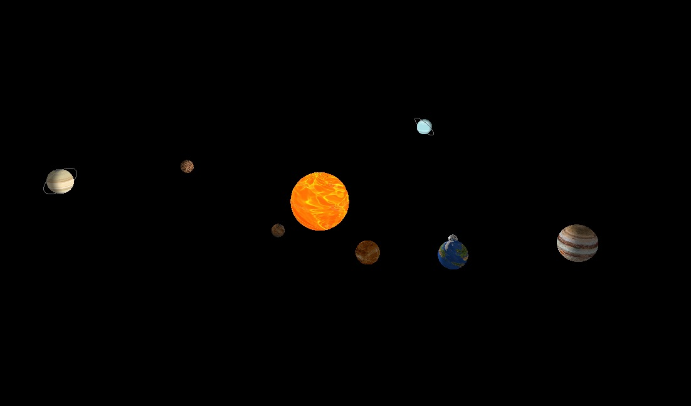

# Simulação do Sistema Solar 🌌

Este projeto é uma simulação do sistema solar em C++, desenvolvida na disciplina de Computação Gráfica. O objetivo é demonstrar o funcionamento dos planetas ao redor do sol usando técnicas de renderização gráfica.

## Demonstração 🚀



## Funcionalidades 🌟

- Simulação em tempo real dos planetas orbitando o sol
- Diferentes velocidades orbitais para cada planeta
- Visualização 3D interativa

## Instalação e Execução 🛠️

### Pré-requisitos

- [C++](https://www.cplusplus.com/)
- [OpenGL](https://www.opengl.org/)
- [GLUT](https://www.opengl.org/resources/libraries/glut/)
- [CMake](https://cmake.org/)

No meu caso, utilizei o Visual Studio Code + linux para compilação do trabalho. Para isso, é necessário instalar o Glut e a biblioteca Soil (necessária para utilização de texturas), que será mostrado em seguida.


### Passos para Instalação

1. Instale o Glut e a bilioteca Soil:
    ```sh
    sudo apt-get install freeglut3-dev
    sudo apt install libsoil-dev
    ```

3. Clone o repositório:
    ```sh
    git clone https://github.com/seu-usuario/sistema_solar.git
    cd sistema_solar
    ```

4. Compile o projeto:
    ```sh
    g++ -o sistema_solar planetario.cpp -lGL -lGLU -lglut -lSOIL
    ```

3. Execute o programa:
    ```sh
    ./sistema_solar
    ```

## Tecnologias Utilizadas 🧰

- **C++**: Linguagem de programação principal
- **OpenGL**: Biblioteca para gráficos 3D
- **GLUT**: Biblioteca para gerenciamento de janelas e entrada de usuário

## Melhorias Futuras ✨

- Adicionar imagem de fundo, simulando o universo
- Desenhar as órbitas de cada planeta
- Ajustar os anéis de Saturno e Urano
- Calcular as velocidades exatas de rotação e translação de cada planeta
